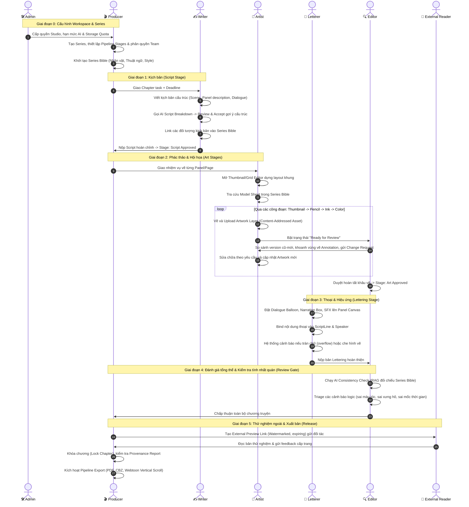

# Quy Trình Hoạt Động Của Tất Cả Các Role (Role Workflows & End-to-End Lifecycle)

> **Dự án:** PanelForge: An AI-Assisted Manga Production Management Platform with a Structured Content Model and Full Revision Provenance  
> **Tài liệu:** Luồng nghiệp vụ chi tiết của từng vai trò (Role Flows) & Vòng đời sản xuất chương truyện (Chapter Production Lifecycle)  
> **Cập nhật:** 19/09/2026

---

## 1. Tổng Quan Hệ Thống Phân Quyền (RBAC & Roles Matrix)

Hệ thống phân quyền trong PanelForge được chia làm 2 cấp:
1. **System Roles (Cấp toàn hệ thống):**
   - `Admin`: Quản trị hạ tầng, tài khoản, quota tài nguyên, audit log.
   - `User`: Người dùng thông thường đã xác thực.
2. **Workspace Roles (Cấp dự án / Studio StudioWorkspace):**
   - `Producer / Series Owner`: Quản lý dự án, cấu hình quy trình, Series Bible, phân công, phê duyệt và xuất bản.
   - `Writer`: Soạn thảo kịch bản cấu trúc, AI Breakdown, liên kết Series Bible.
   - `Artist` (bao gồm `Penciler`, `Inker`, `Colorist`): Lên layout khung hình, vẽ và upload artwork theo từng công đoạn.
   - `Letterer`: Đặt bóng thoại, hộp thoại, hiệu ứng âm thanh (SFX), liên kết kịch bản.
   - `Editor / Reviewer`: Soát lỗi, gắn ghi chú khoanh vùng (Region Annotation), kiểm tra logic với Series Bible, phê duyệt hoặc yêu cầu sửa đổi (Change Request).
   - `Reader / External Stakeholder`: Khách ngoài, xem bản thử nghiệm qua link bảo mật có watermark, đóng góp ý kiến.

---

## 2. Vòng Đời Sản Xuất 1 Chương Truyện (End-to-End Chapter Lifecycle)

Dưới đây là sơ đồ tương tác tổng thể giữa các vai trò trong quá trình tạo ra một chương truyện hoàn chỉnh:



---

## 3. Luồng Chi Tiết Của Từng Role (Detailed Role Flows)

### 3.1. 🛠️ Administrator (Quản Trị Viên Hệ Thống)

**Mục tiêu:** Đảm bảo hệ thống hoạt động ổn định, kiểm soát hạn mức chi phí (AI & Cloud Storage) và quản lý người dùng toàn hệ thống.

```
[Đăng nhập Admin Portal]
       │
       ├─► [1. Quản lý Tài khoản & Workspace]
       │     ├─ Tạo / Khóa / Mở khóa tài khoản người dùng
       │     ├─ Cấp quyền SystemRole (Admin, User)
       │     └─ Tạo Studio Workspace & gán Producer quản lý
       │
       ├─► [2. Cấu hình Tài nguyên AI (AI Provider Configuration)]
       │     ├─ Cấu hình API Key (OpenAI, Google Gemini, Anthropic)
       │     ├─ Thiết lập Model khả dụng cho từng Workspace (vd: GPT-4o, Claude 3.5 Sonnet)
       │     ├─ Thiết lập Token Quota hàng tháng cho từng Studio
       │     └─ Cấu hình chiến lược Fallback khi nhà cung cấp AI gặp sự cố
       │
       ├─► [3. Cấu hình Lưu trữ & Bản sao lưu (Storage & Retention)]
       │     ├─ Giới hạn dung lượng lưu trữ (Storage Quota) cho từng Studio
       │     ├─ Cấu hình chính sách lưu trữ (Retention Policy) cho các file nháp tạm
       │     └─ Lịch sao lưu tự động Event Store & Object Storage
       │
       └─► [4. Giám sát Hệ thống & Kiểm toán (Audit & System Stats)]
             ├─ Xem Audit Log toàn hệ thống (ai đã truy cập/thay đổi gì)
             ├─ Báo cáo mức độ sử dụng AI & chi phí phát sinh
             └─ Quản lý danh mục dùng chung (Stage Templates, Presets Typography, Export Presets)
```

---

### 3.2. 🎬 Producer / Series Owner (Nhà Sản Xuất / Chủ Dự Án)

**Mục tiêu:** Quản lý tiến độ sản xuất, nhân sự, tính toàn vẹn của tác phẩm và chất lượng phát hành.

```
[Đăng nhập Workspace]
       │
       ├─► [1. Thiết lập Bộ Truyện (Series Setup)]
       │     ├─ Tạo Series mới (Tiêu đề, Tóm tắt, Layout: Truyền thống / Webtoon)
       │     ├─ Cấu hình Pipeline Stages chuẩn (vd: Script → Thumb → Pencil → Ink → Color → Letter → Review → Done)
       │     └─ Thiết lập lịch phát hành dự kiến (Release Calendar)
       │
       ├─► [2. Quản lý Đội ngũ & Phân công (Team & Task Management)]
       │     ├─ Mời thành viên vào Workspace & gán vai trò (Writer, Artist, Letterer, Editor)
       │     ├─ Giao việc cấp Chapter hoặc cấp Panel cho từng cá nhân
       │     └─ Đặt Deadline và ràng buộc phụ thuộc (Dependency: khâu Ink chỉ làm khi Pencil xong)
       │
       ├─► [3. Xây dựng & Duy trì Series Bible]
       │     ├─ Tạo hồ sơ Nhân vật (Character Sheets: ngoại hình, tính cách, quan hệ, ảnh model sheet)
       │     ├─ Tạo hồ sơ Địa điểm (Locations), Đạo cụ (Props)
       │     ├─ Định nghĩa Từ điển thuật ngữ (Terminology, cách xưng hô)
       │     └─ Ghi nhận các sự kiện cốt truyện đã xảy ra (Established Plot Facts)
       │
       ├─► [4. Giám sát Tiến độ (Production Dashboard)]
       │     ├─ Theo dõi tiến độ thời gian thực đến từng Panel (Panel-level Progress)
       │     ├─ Xem biểu đồ khối lượng công việc (Workload) & Burndown Chart
       │     └─ Phát hiện điểm nghẽn (Bottlenecks) và các đầu việc quá hạn (Overdue items)
       │
       └─► [5. Nghiệm thu, Xuất bản & Truy vết (Approval & Release)]
             ├─ Xem Báo cáo Nguồn gốc (Provenance Report): tỷ lệ đóng góp của AI, ai đã duyệt
             ├─ Khôi phục (Rollback) bất kỳ thực thể nào về phiên bản trước nếu xảy ra sự cố
             ├─ Phê duyệt & Khóa chương (Lock Chapter) chống sửa đổi
             └─ Kích hoạt xuất bản sang các định dạng (PDF, CBZ, Webtoon, JSON Schema)
```

---

### 3.3. ✍️ Writer (Biên Kịch)

**Mục tiêu:** Sáng tác nội dung kịch bản mạch lạc, có cấu trúc máy đọc được, tận dụng AI để bóc tách phân cảnh.

```
[Mở Task được giao] ──► [Vào Structured Script Editor]
                                │
       ┌────────────────────────┴────────────────────────┐
       ▼                                                 ▼
[1. Soạn thảo thủ công]                          [2. AI Assistance Layer]
  ├─ Tạo khối Scene (Bối cảnh, Thời gian)          ├─ Bấm "Request AI Script Breakdown"
  ├─ Viết Panel Description & Shot Notes           ├─ Hệ thống LLM tự động bóc tách kịch bản
  ├─ Viết thoại (Dialogue Line) & gán Speaker      │  thành Scene -> Page -> Panel -> Dialogue
  └─ Viết Narration & Sound Effect (SFX)           ├─ Writer kiểm tra bảng đề xuất:
                                                   │    • Chấp nhận (Accept) -> Ghi vào Event Store kèm Provenance
                                                   │    • Chỉnh sửa (Edit) -> Lưu kèm dấu vết chỉnh sửa
                                                   │    • Từ chối (Reject) -> Hủy bỏ gợi ý
                                                   └────────────────────────┬───────────────────────┘
                                                                            │
                                                                            ▼
                                                 [3. Liên kết Series Bible (Grounding)]
                                                   ├─ Tag tên nhân vật trong kịch bản với Character trong Bible
                                                   ├─ Tag địa điểm, đạo cụ với hồ sơ tương ứng
                                                   └─ Kiểm tra gợi ý chính tả/thuật ngữ chuẩn
                                                                            │
                                                                            ▼
                                                 [4. Quản lý Phiên bản & Bàn giao]
                                                   ├─ So sánh các bản thảo kịch bản (Script Diffs)
                                                   ├─ Revert về bản cũ nếu cần
                                                   └─ Đánh dấu "Script Completed" chuyển tiếp sang khâu Vẽ
```

---

### 3.4. 🎨 Artist (Họa Sĩ - Penciler / Inker / Colorist)

**Mục tiêu:** Tiếp nhận brief kịch bản, tra cứu tư liệu chuẩn và thực hiện các lớp vẽ qua từng giai đoạn sản xuất.

```
[Đăng nhập] ──► [Personal Task Queue] (Xem danh sách Panel/Page cần vẽ, deadline, brief)
                      │
                      ▼
[Mở Canvas Workspace của Trang truyện]
       │
       ├─► [1. Lên Bố cục (Layout & Thumbnail Planner)]
       │     ├─ Xem kịch bản phân cảnh tương ứng ngay cạnh canvas
       │     ├─ Tra cứu tài liệu tham khảo: Mở tab Series Bible xem Model Sheet nhân vật, bảng màu
       │     ├─ Dựng layout khung lưới (Grid) hoặc dùng công cụ chia panel
       │     └─ (Tùy chọn) Yêu cầu AI gợi ý bố cục khung hình (Layout Suggestion)
       │
       ├─► [2. Thực hiện Vẽ & Tải lên Artwork]
       │     ├─ Vẽ trên phần mềm đồ họa chuyên nghiệp (Clip Studio / Photoshop / Procreate)
       │     ├─ Upload file vẽ lên hệ thống qua cơ chế Direct Upload CAS:
       │     │    • Chọn công đoạn tương ứng (Thumbnail / Pencil / Ink / Color)
       │     │    • File tự động tính SHA-256 hash và chống trùng lặp dữ liệu
       │     └─ Đánh dấu layer thuộc tính (Lineart, Background, Flat Color)
       │
       ├─► [3. Xử lý Phản hồi (Change Requests)]
       │     ├─ Nhận thông báo có ghi chú review từ Editor
       │     ├─ Xem trực tiếp các vùng bị khoanh đỏ (Region-anchored Annotations) trên bản vẽ
       │     ├─ Đọc comment giải thích cần sửa gì
       │     ├─ Vẽ lại và upload bản sửa đổi mới (Version n+1)
       │     └─ Đánh dấu "Resolved" cho từng Change Request
       │
       └─► [4. Bàn giao]
             └─ Đổi trạng thái Panel/Page sang "Ready for Review"
```

---

### 3.5. 💬 Letterer (Chuyên Viên Thoại & Hiệu Ứng Chữ)

**Mục tiêu:** Biến kịch bản thoại thành các bóng thoại (balloon) và hiệu ứng chữ thẩm mỹ, đúng thứ tự đọc và không che chi tiết quan trọng.

```
[Mở Page Canvas Editor]
       │
       ├─► [1. Nạp Kịch Bản & Đồng Bộ Thoại]
       │     ├─ Mở danh sách Script Lines của trang đã được Writer duyệt
       │     └─ Kéo thả từng dòng thoại vào khung hình tương ứng
       │
       ├─► [2. Tạo & Tinh Chỉnh Element]
       │     ├─ Chọn loại Element:
       │     │    • `DialogueBalloon`: Lời thoại nhân vật (chọn đuôi bóng trỏ về speaker)
       │     │    • `NarrationBox`: Khung dẫn truyện góc panel
       │     │    • `SoundEffect (SFX)`: Chữ tượng thanh nghệ thuật
       │     ├─ Tự động liên kết (Binding): Element lưu ID trỏ về `ScriptLineId` và `SpeakerId`
       │     ├─ Kéo thả vị trí (X, Y) và kích thước (Width, Height) — kích hoạt `ElementMovedEvent`
       │     └─ Áp dụng Typography Presets của Series (Font chữ, Size, Line height, Stroke)
       │
       ├─► [3. Kiểm Tra Cảnh Báo Tự Động (Validation Warnings)]
       │     ├─ Cảnh báo tràn chữ (Text Overflow): Kích thước bóng quá nhỏ so với lượng chữ
       │     ├─ Cảnh báo che hình quan trọng (Artwork Overlap): Bóng thoại đè lên mặt nhân vật
       │     └─ Cảnh báo thứ tự đọc (Reading Order): Sắp xếp bóng thoại vi phạm thứ tự đọc (trái qua phải hoặc phải qua trái)
       │
       └─► [4. Hoàn Tất]
             └─ Đánh dấu "Lettering Complete" gửi sang bước Review
```

---

### 3.6. 🔍 Editor / Reviewer (Biên Tập Viên / Người Kiểm Duyệt)

**Mục tiêu:** Đảm bảo chất lượng nghệ thuật, tính logic của cốt truyện và giữ vững sự nhất quán của bộ truyện qua hàng trăm chương.

```
[Nhận thông báo Review] ──► [Mở Review Workspace]
                                   │
       ┌───────────────────────────┼───────────────────────────┐
       ▼                           ▼                           ▼
[1. So Sánh Phiên Bản]     [2. Khoanh Vùng & Note]     [3. AI Consistency Check]
  ├─ Mở chế độ Side-by-side  ├─ Dùng công cụ vẽ         ├─ Bấm "Run Consistency Check"
  │  so sánh giữa 2 version  │  (Pen/Rectangle) khoanh  ├─ AI quét kịch bản + artwork
  ├─ Kiểm tra các thay đổi   │  trực tiếp lên vùng lỗi  │  đối chiếu với Series Bible:
  │  về nét vẽ, màu sắc,     ├─ Gắn Comment chi tiết    │    • Nhân vật sai màu mắt/sẹo
  │  vị trí bóng thoại       │  vào tọa độ chính xác    │    • Sai xưng hô/thuật ngữ
  └─ Xem diff lịch sử        └─ Tạo "Change Request"    │    • Vi phạm mốc sự kiện
                               yêu cầu Artist sửa       └─ Editor triage kết quả (bỏ qua
                                                          cảnh báo sai hoặc xác nhận lỗi)
                                   │
                                   ▼
                 [4. Quyết Định Kiểm Duyệt (Decision Gate)]
                   ├─ NẾU CÒN LỖI:
                   │    └─ Bấm "Request Changes" -> Giao việc sửa về cho Artist/Letterer kèm danh sách Change Requests
                   └─ NẾU ĐẠT YÊU CẦU:
                        └─ Bấm "Approve Submission" -> Ký duyệt công đoạn, đẩy tiến độ Panel sang Approved
```

---

### 3.7. 👥 Reader / External Stakeholder (Khách Ngoài / Độc Giả Thử Nghiệm)

**Mục tiêu:** Xem trước bản thảo để nghiệm thu hợp đồng hoặc khảo sát phản hồi độc giả mà không làm rò rỉ tác phẩm.

```
[Nhận Liên Kết Chia Sẻ (Email/Chat)]
       │
       ▼
[Mở Link: /preview/{token}]
       │
       ├─► [1. Xác thực & Ràng buộc Bảo mật]
       │     ├─ Kiểm tra token còn hiệu lực không (Expiring Link: 24h - 7 ngày)
       │     ├─ Ghi nhận nhật ký truy cập (Audit Log: IP, thiết bị, thời gian)
       │     └─ Tải ảnh đã được đóng dấu chìm (Dynamic Watermark: email + IP mờ trên từng panel)
       │
       ├─► [2. Trải nghiệm Đọc (Reading Mode)]
       │     ├─ Chế độ Manga truyền thống (Lật trang ngang, hỗ trợ đọc từ phải sang trái RTL)
       │     └─ Chế độ Webtoon (Cuộn dọc Vertical Scroll liền mạch)
       │
       └─► [3. Đóng góp Ý kiến (Feedback Form)]
             ├─ Gửi đánh giá / bình luận tổng quan cấp Chương (Chapter-level feedback)
             └─ Gửi bình luận nhanh theo từng Trang (Page-level feedback)
             *(Lưu ý: Không có quyền truy cập vào Canvas hay cấu trúc Workspace sản xuất)*
```

---

### 3.8. 👤 Authenticated Users (Tính Năng Dùng Chung Cho Mọi Tài Khoản Đăng Nhập)

Mọi người dùng sau khi đăng nhập đều có luồng tương tác cá nhân:
1. **Quản lý Tài Khoản:** Đổi mật khẩu, bật xác thực 2 bước (2FA), liên kết tài khoản Firebase/Google.
2. **Trung tâm Thông báo (Notification Center):**
   - Nhận thông báo in-app và email khi: được phân công task mới, được `@mention` trong comment, có submission cần duyệt, hoặc task sắp đến hạn (due date).
3. **Tìm kiếm Toàn Diện (Global Cross-Entity Search):**
   - Tìm nhanh từ khóa xuất hiện trong: kịch bản kịch, tên nhân vật trong Series Bible, nhãn khung hình, hoặc các bình luận trao đổi.
4. **Nhật ký Hoạt động (Activity Feed & Audit Trail):**
   - Theo dõi dòng sự kiện thời gian thực của những Series mình tham gia: ai vừa commit bản vẽ mới, ai vừa hoàn thành review.

---

## 4. Bảng Tổng Hợp Ma Trận Quyền Hạn (Permission Matrix)

| Chức năng / Hành động | Admin | Producer | Writer | Artist | Letterer | Editor | External |
|---|:---:|:---:|:---:|:---:|:---:|:---:|:---:|
| **Quản lý Studio & Quota AI** | ✅ | ❌ | ❌ | ❌ | ❌ | ❌ | ❌ |
| **Tạo Series & Mời thành viên** | ✅ | ✅ | ❌ | ❌ | ❌ | ❌ | ❌ |
| **Tạo / Cập nhật Series Bible** | ✅ | ✅ | 🟡 (Đề xuất) | 👁️ (Xem) | 👁️ (Xem) | 🟡 (Góp ý) | ❌ |
| **Viết Script & Gọi AI Breakdown** | ❌ | ✅ | ✅ | 👁️ (Xem) | 👁️ (Xem) | 👁️ (Xem) | ❌ |
| **Vẽ & Upload Artwork Layer** | ❌ | ✅ | ❌ | ✅ | ❌ | ❌ | ❌ |
| **Đặt Balloon, SFX & Gõ thoại** | ❌ | ✅ | ❌ | ❌ | ✅ | ❌ | ❌ |
| **Khoanh vùng Annotation & Review** | ❌ | ✅ | ❌ | ❌ | ❌ | ✅ | ❌ |
| **Chạy AI Consistency Check** | ❌ | ✅ | 🟡 | ❌ | ❌ | ✅ | ❌ |
| **Duyệt (Approve) / Khóa Chapter** | ❌ | ✅ | ❌ | ❌ | ❌ | 🟡 (Stage gate) | ❌ |
| **Xem trước qua link Watermark** | ❌ | ✅ | ✅ | ✅ | ✅ | ✅ | ✅ |
| **Xuất bản (Export PDF, CBZ, Webtoon)** | ❌ | ✅ | ❌ | ❌ | ❌ | ❌ | ❌ |

---

## 5. Kết Luận

Kiến trúc luồng công việc trên đảm bảo:
1. **Không có nút thắt cổ chai vô hình:** Mọi tiến độ được theo dõi chi tiết tới từng Panel và từng Layer.
2. **Phản hồi gắn liền với hiện vật:** Editor không còn gửi tin nhắn chung chung trên chat; comment và nét vẽ khoanh vùng được khóa chặt vào tọa độ và phiên bản của panel.
3. **Mọi can thiệp đều có nguồn gốc (Full Provenance):** Mọi hành động kéo thả, tải file, gọi AI hay sửa đổi đều được ghi thành chuỗi sự kiện bất biến (Event Store), sẵn sàng cho việc nghiệm thu, giải trình bản quyền và khôi phục khi cần thiết.
