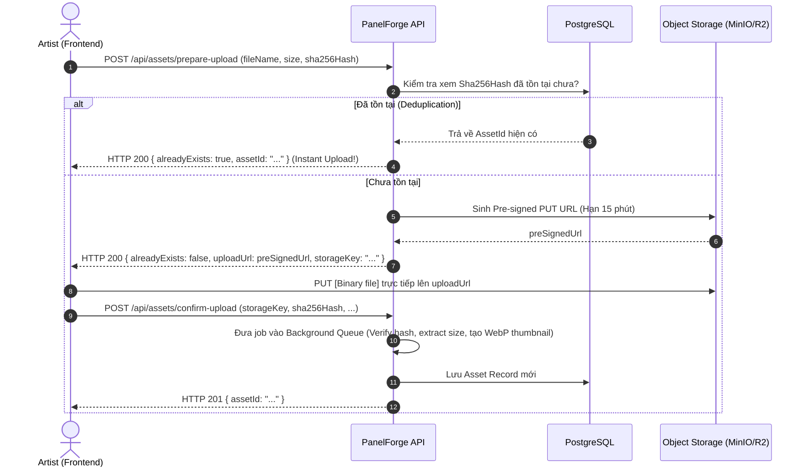

# Thiết Kế Kiến Trúc Lưu Trữ Ảnh & Tài Sản Đồ Họa (Asset Storage Architecture)

> **Dự án:** PanelForge — Manga Production Management Platform  
> **Tài liệu kỹ thuật:** Chiến lược & kiến trúc lưu trữ ảnh nhị phân cho hệ thống  
> **Tác giả:** Đội ngũ kiến trúc hệ thống

---

## 1. Bối Cảnh & Thách Thức Đặc Thù Của PanelForge

Trong một nền tảng sản xuất manga/webtoon cộng tác như PanelForge, **ảnh không phải là tài liệu đính kèm thông thường** mà là trung tâm của sản phẩm:
1. **Dung lượng lớn và độ phân giải cao:** Bản vẽ manga phục vụ in ấn thường có độ phân giải từ 300 đến 600 DPI, kích thước file thô từ 10MB đến 50MB+ cho mỗi trang.
2. **Nhiều layer & nhiều phiên bản (Revisions):** Một trang (Page) gồm nhiều khung (Panel), mỗi khung có nhiều lớp (ArtworkLayer: phác thảo, nét ink, màu, đổ bóng). Qua từng công đoạn (Thumbnail → Pencil → Ink → Color), số lượng file ảnh sinh ra tăng theo cấp số nhân.
3. **Tính bất biến trong Event Sourcing & Provenance:** Toàn bộ lịch sử chỉnh sửa được lưu dạng Event Store. Hệ thống cam kết có thể quay ngược thời gian (rollback) để xem lại trang truyện ở bất kỳ thời điểm nào. **Nếu một file ảnh bị sửa đổi hoặc ghi đè, tính toàn vẹn của lịch sử phiên bản sẽ bị phá hủy hoàn toàn.**
4. **Bảo mật bản quyền (Chống rò rỉ tác phẩm chưa phát hành):** Bản vẽ của các chương truyện chưa xuất bản là tài sản thương mại tối mật. Cần ngăn chặn việc lộ đường dẫn tĩnh (public URL) và cần có cơ chế đóng dấu bản quyền (Watermarking) cho các liên kết xem thử (Preview links).

---

## 2. So Sánh Các Giải Pháp Lưu Trữ

| Tiêu chí | Lưu vào CSDL (BLOB / Base64) | Lưu Ổ Cứng Server (Local File System) | Lưu Object Storage Thường (Tên file ngẫu nhiên) | **Content-Addressable Storage (CAS) trên Object Storage (Đề xuất)** |
|---|:---:|:---:|:---:|:---:|
| **Khả năng mở rộng (Scalability)** | ❌ Rất kém (DB phình to, backup chậm) | ❌ Kém (chết khi scale đa server / Docker) | ✅ Tốt (S3 scale không giới hạn) | ✅ **Rất tốt** |
| **Chống trùng lặp (Deduplication)** | ❌ Không | ❌ Không | ❌ Trùng lặp lớn giữa các version | ✅ **Tuyệt đối (100% không lưu trùng)** |
| **Tính bất biến & Toàn vẹn (Immutability)** | 🟡 Tùy cấu hình DB | ❌ Dễ bị ghi đè / mất file | 🟡 Có thể bị ghi đè nếu trùng key | ✅ **Bất biến tuyệt đối theo Hash SHA-256** |
| **Bảo mật & Chống Leak** | 🟡 Thông qua API | 🟡 Phải viết file stream qua API | ✅ Hỗ trợ Pre-signed URL | ✅ **Hỗ trợ Pre-signed URL + Watermark** |
| **Tải & Render trên Canvas** | ❌ Chậm chạp, nghẽn RAM | 🟡 Tốn băng thông máy chủ | 🟡 Phải tự quản lý thumbnail | ✅ **Multi-resolution (Gốc + WebP Display + Thumb)** |

---

## 3. Kiến Trúc Đề Xuất: Content-Addressable Storage (CAS) + S3-Compatible

Mô hình này lấy cảm hứng từ cơ chế lưu trữ của **Git LFS** và **Hệ thống phân tán Content-Addressed**: **Tên và định danh của file chính là mã băm SHA-256 nội dung của file đó.**

```
                                      ┌────────────────────────────────────────┐
                                      │        Client (FE Canvas Editor)       │
                                      └───────┬────────────────────────▲───────┘
                                              │ 1. Hash SHA-256        │ 4. Direct Upload
                                              │    & Check existence   │    via Pre-signed PUT URL
                                              ▼                        │
                         ┌────────────────────────────────────────┐    │
                         │          PanelForge Backend            │    │
                         │  - Check Hash in DB (Deduplication)    │    │
                         │  - Generate Pre-signed URLs            │    │
                         │  - RBAC / Watermarking Service         │    │
                         └───────┬────────────────────────┬───────┘    │
                                 │                        │            │
            2. Metadata Query    │                        │ 3. Sign    │
            & Insert Entity      ▼                        ▼            ▼
                         ┌──────────────┐         ┌────────────────────────────┐
                         │  PostgreSQL  │         │   Object Storage (S3/R2)   │
                         │  (Assets DB) │         │                            │
                         └──────────────┘         │  assets/                   │
                                                  │   └── 3a/                  │
                                                  │       └── f8/              │
                                                  │           └── 3af8...png   │
                                                  │  variants/                 │
                                                  │   └── 3af8..._thumb.webp   │
                                                  │   └── 3af8..._display.webp │
                                                  └────────────────────────────┘
```

### 3.1. Nguyên Lý Content-Addressable Storage (CAS)

1. Khi người dùng chọn tải lên một ảnh (ví dụ: `sketch_panel_1.png`):
   - Client hoặc Server tính mã băm `SHA-256` của nội dung nhị phân:  
     `hash = "3af8d9c2e14b...89a0"`
2. Đường dẫn lưu trữ trên Object Storage (S3 Storage Key) được chuẩn hóa theo cấu trúc sharding để tối ưu cây thư mục:  
   `assets/original/{hash[0..2]}/{hash[2..4]}/{hash}.{ext}`  
   *Ví dụ:* `assets/original/3a/f8/3af8d9c2e14b...89a0.png`
3. **Lợi ích cốt lõi:**
   - **Deduplication tức thì (Tối ưu 100% dung lượng):** Nếu 2 artist tải lên cùng một bản vẽ, hoặc khi nhân bản một Panel có chung hình nền, hệ thống kiểm tra thấy Hash đã tồn tại trong DB -> **Không cần upload lại, không tốn thêm 1 byte ổ cứng nào**, chỉ cần trỏ `AssetId` về bản ghi cũ.
   - **Bảo toàn toàn vẹn lịch sử (Provenance & Event Sourcing):** Mỗi phiên bản trong quá khứ trỏ tới một Hash cụ thể. Do tên file gắn liền với nội dung, không một ai có thể sửa nội dung mà giữ nguyên được Hash.
   - **Xác minh tính toàn vẹn (Integrity Verification):** Bất cứ khi nào tải file, hệ thống có thể băm lại để đảm bảo file trên cloud không bị hỏng hóc hay can thiệp.

---

## 4. Thiết Kế Cơ Sở Dữ Liệu (Asset Entity)

Trong PostgreSQL (quản lý bởi EF Core), chúng ta cần bổ sung bảng `Assets` để lưu trữ siêu dữ liệu (metadata) của các file:

```csharp
namespace PanelForge.Domain.Entities.Storage;

public class Asset : BaseEntity
{
    public Guid Id { get; set; } = Guid.NewGuid();

    /// <summary>
    /// Mã băm SHA-256 nội dung nhị phân (Dùng cho Content-Addressable Storage & Deduplication).
    /// Được đánh chỉ mục Unique.
    /// </summary>
    public string Sha256Hash { get; set; } = default!;

    /// <summary>
    /// Tên file gốc người dùng tải lên (để hiển thị UI khi cần).
    /// </summary>
    public string OriginalFileName { get; set; } = default!;

    /// <summary>
    /// Định dạng MIME (image/png, image/jpeg, image/webp, image/clip-studio...).
    /// </summary>
    public string MimeType { get; set; } = default!;

    /// <summary>
    /// Dung lượng file tính bằng Byte.
    /// </summary>
    public long SizeBytes { get; set; }

    /// <summary>
    /// Chiều rộng (pixels).
    /// </summary>
    public int Width { get; set; }

    /// <summary>
    /// Chiều cao (pixels).
    /// </summary>
    public int Height { get; set; }

    /// <summary>
    /// Khóa lưu trữ file gốc trên S3 / Object Storage.
    /// </summary>
    public string StorageKey { get; set; } = default!;

    /// <summary>
    /// Khóa lưu trữ ảnh hiển thị trên Web (đã nén WebP kích thước phù hợp màn hình).
    /// </summary>
    public string? DisplayStorageKey { get; set; }

    /// <summary>
    /// Khóa lưu trữ ảnh Thumbnail (WebP 256x256 / 512x512).
    /// </summary>
    public string? ThumbnailStorageKey { get; set; }

    /// <summary>
    /// Workspace sở hữu tài nguyên này (để kiểm soát hạn mức lưu trữ Storage Quota).
    /// </summary>
    public Guid WorkspaceId { get; set; }

    /// <summary>
    /// Người tải lên.
    /// </summary>
    public Guid UploadedByUserId { get; set; }

    /// <summary>
    /// Số lượng đối tượng đang tham chiếu tới Asset này (Reference Counter).
    /// Giúp dọn dẹp (Garbage Collection) các asset mồ côi nếu cần.
    /// </summary>
    public int ReferenceCount { get; set; } = 1;

    public DateTime CreatedAt { get; set; } = DateTime.UtcNow;
}
```

---

## 5. Quy Trình Xử Lý Tải Lên (Upload Flow) & Phân Phối Ảnh

### 5.1. Quy Trình Direct Upload Tối Ưu Băng Thông (Pre-signed URL)

Thay vì để client tải file 50MB qua Backend API rồi Backend mới đẩy lên S3 (gây nghẽn RAM và băng thông máy chủ .NET), hệ thống sử dụng quy trình **Pre-signed URL**:



### 5.2. Đường Ống Xử Lý Ảnh Đa Kích Thước (Image Processing Pipeline)

Khi file gốc được tải lên thành công:
1. **Master Asset (Original):** Giữ nguyên vẹn 100% định dạng gốc (PNG/TIFF không nén mất dữ liệu) để phục vụ xuất bản in ấn (Print Export) sau này.
2. **Display Variant (Tối ưu cho Editor):** Chuyển đổi sang định dạng `.webp` với độ phân giải giới hạn (ví dụ tối đa 2048px chiều dài, quality 85%). Dùng variant này để load lên **Canvas Editor**, giúp thao tác kéo thả mượt mà, không giật lag.
3. **Thumbnail Variant (Tối ưu cho Dashboard):** Chuyển đổi sang `.webp` kích thước 256px hoặc 512px để hiển thị danh sách trang, task board, preview nhỏ.
4. **Công cụ xử lý khuyến nghị:** Sử dụng thư viện **`SixLabors.ImageSharp`** hoặc **`SkiaSharp`** chạy trực tiếp trong C# .NET Core mà không cần cài đặt ImageMagick ngoài hệ thống.

---

## 6. Bảo Mật & Phân Phối Ảnh (Security & Delivery)

1. **Storage Bucket ở chế độ Private 100%:** Tuyệt đối không bật Public Read cho Bucket chứa truyện. Mọi truy cập trực tiếp từ bên ngoài đều bị từ chối (`403 Forbidden`).
2. **Xem ảnh trong Workspace:** 
   - Khi Artist/Editor xem một trang trên hệ thống, Frontend gọi API `GET /api/assets/{assetId}/view-url`.
   - Backend kiểm tra xem User có quyền truy cập vào Workspace/Series/Chapter đó không (thông qua `WorkspaceAuthorizationService`).
   - Nếu hợp lệ, Backend sinh **Pre-signed GET URL** có hạn ngắn (15–30 phút). Trình duyệt dùng URL này để tải ảnh hiển thị.
3. **External Reviewer Preview (Xem trước bên ngoài):**
   - Với các đối tác hoặc reviewer không có tài khoản nội bộ: Sử dụng liên kết chia sẻ tạm thời (`ExternalPreviewLink`).
   - Hình ảnh khi xem qua link này sẽ được Backend đóng dấu chìm (Dynamic Watermarking): in mờ email người xem + timestamp lên từng panel để chống chụp màn hình tuồn ra ngoài.
   - Ghi nhật ký truy cập (Audit Log) mỗi lần link được mở.

---

## 7. Hạ Tầng Công Nghệ Lưu Trữ Cụ Thể

Hệ thống sử dụng chuẩn giao tiếp **S3-Compatible API**, cho phép chuyển đổi linh hoạt giữa các môi trường mà không cần sửa code:

### 7.1. Môi trường Local Development & Test: MinIO
- Chạy thông qua Docker Compose (được bổ sung vào `docker-compose.yml`).
- Hoàn toàn miễn phí, độc lập, không cần Internet khi code.
- Giao diện MinIO Console (`localhost:9001`) trực quan để kiểm tra file.

### 7.2. Môi trường Production / Cloud: Cloudflare R2 (Khuyến nghị số 1)
- **Lý do chọn Cloudflare R2:**
  - **Miễn phí 100% chi phí Egress Bandwidth:** Đối với nền tảng truyện tranh, dung lượng tải ảnh về cho hàng nghìn lượt xem/vẽ sẽ tốn hàng trăm GB băng thông mỗi tháng. Trên AWS S3, chi phí bandwidth này rất đắt; trên Cloudflare R2, **băng thông tải ra là 0 đồng**.
  - Tương thích 100% chuẩn S3 API (dùng chung thư viện `AWSSDK.S3` của .NET).
  - Tốc độ CDN toàn cầu cực nhanh.

---

## 8. Lộ Trình Triển Khai Cho Team

### Bước 1: Hạ tầng (BE)
- Cập nhật `docker-compose.yml` để thêm container **MinIO** phục vụ môi trường dev.
- Cài đặt package `AWSSDK.S3` và `SixLabors.ImageSharp` vào `PanelForge.Infrastructure`.

### Bước 2: Domain & Persistence (BE1)
- Tạo Entity `Asset` trong `PanelForge.Domain.Entities.Storage`.
- Cấu hình EF Core DbContext và tạo Migration `AddAssetsTable`.

### Bước 3: Service Layer (BE2 / BE3)
- Tạo interface `IObjectStorageService` (UploadAsync, GeneratePreSignedPutUrl, GeneratePreSignedGetUrl, DeleteAsync).
- Tạo interface `IImageProcessingService` (GenerateVariantsAsync, ExtractMetadataAsync).
- Triển khai implementation tương ứng trong Infrastructure.

### Bước 4: API Layer
- Xây dựng `AssetsController`:
  - `POST /api/assets/prepare-upload`: Kiểm tra hash & cấp Pre-signed PUT URL.
  - `POST /api/assets/confirm-upload`: Xác nhận upload thành công & trigger xử lý ảnh.
  - `GET /api/assets/{id}/view-url`: Cấp Pre-signed GET URL có kiểm tra quyền.

### Bước 5: Frontend Integration (FE1)
- Xây dựng tiện ích tính SHA-256 hash trên trình duyệt (dùng Web Crypto API `crypto.subtle.digest`).
- Tích hợp direct upload vào Canvas Editor và Avatar/Series Cover Upload.
